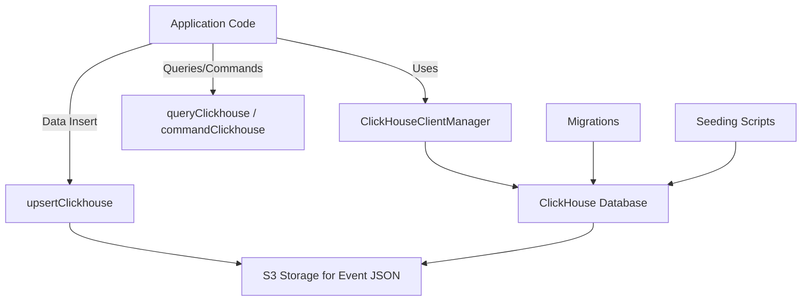

# Evaluation Plan for Migrating from ClickHouse to GreptimeDB

## Overview

This document evaluates the feasibility and impact of migrating the current ClickHouse usage in the project to GreptimeDB. It covers architecture, client integration, query execution, schema management, data ingestion, and deployment considerations.

## Current Architecture with ClickHouse

- The application uses a singleton ClickHouse client manager configured via environment variables.
- Queries and commands are executed through abstracted functions (`queryClickhouse`, `commandClickhouse`).
- Query construction uses ClickHouse-specific SQL filters and factories.
- Data insertion involves event metadata in ClickHouse and event JSON files stored in S3.
- Schema migrations are managed via golang-migrate with clustered and unclustered migration scripts.
- Seeding scripts prepare initial data by querying ClickHouse and creating datasets.

## GreptimeDB Migration Evaluation

### 1. Client and Connection Management
- GreptimeDB supports PostgreSQL wire protocol and native clients.
- Need to evaluate available GreptimeDB client libraries for Node.js/TypeScript.
- Adapt or rewrite the singleton client manager to support GreptimeDB connection pooling and configuration.

### 2. Query and Command Execution
- GreptimeDB supports SQL but may have dialect differences from ClickHouse.
- Abstracted query and command functions (`queryClickhouse`, `commandClickhouse`) need to be adapted or rewritten for GreptimeDB.
- Consider query parameterization and result parsing compatibility.

### 3. Query Construction and SQL Dialect
- Current query construction uses ClickHouse-specific filters and SQL factories.
- Need to audit and adapt these to GreptimeDB SQL dialect and capabilities.
- Some ClickHouse-specific functions or data types may require alternative implementations.

### 4. Schema and Migration Strategy
- Current migrations use golang-migrate with ClickHouse-specific migration scripts.
- Evaluate if golang-migrate supports GreptimeDB or if another migration tool is needed.
- Convert existing migration scripts to GreptimeDB-compatible SQL.
- Adjust clustered/unclustered migration logic as per GreptimeDB architecture.

### 5. Data Seeding and Ingestion
- Seeding scripts query ClickHouse and prepare datasets.
- Adapt seeding scripts to query GreptimeDB.
- Data ingestion via upsert functions needs to be adapted for GreptimeDB client and data model.
- Evaluate S3 event JSON storage compatibility or alternative ingestion pipelines.

### 6. Data Migration and Compatibility
- Plan data migration from ClickHouse to GreptimeDB.
- Export data from ClickHouse and import into GreptimeDB with schema mapping.
- Validate data integrity and query performance post-migration.

### 7. Impact on Existing Code and Services
- Refactor codebase to replace ClickHouse client and query abstractions with GreptimeDB equivalents.
- Update table definitions and query filters.
- Test all affected services and APIs for correctness and performance.

### 8. Deployment and Configuration Changes
- Update environment variables and configuration for GreptimeDB connection.
- Adjust deployment scripts and infrastructure for GreptimeDB.
- Monitor and tune GreptimeDB performance in production.

## Conclusion

Migrating from ClickHouse to GreptimeDB is feasible but requires significant changes in client integration, query construction, schema migration, and data ingestion. A detailed migration plan and testing strategy are essential to ensure a smooth transition.

---

This evaluation plan can be expanded with detailed migration steps and timelines upon approval.